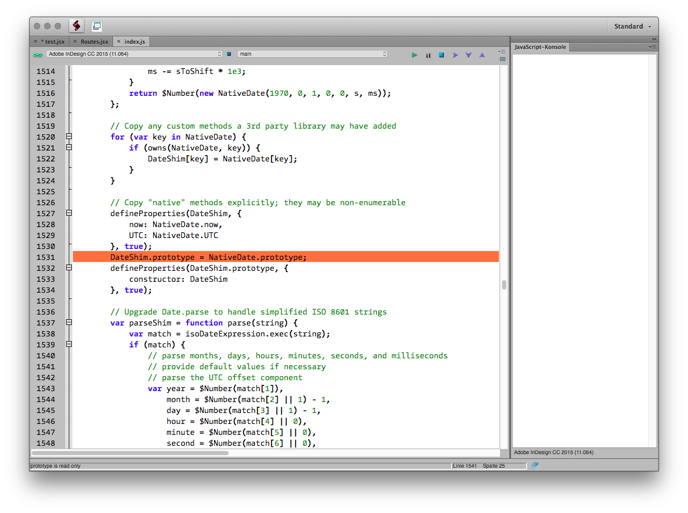

extendscript6
=============

Proof of concept for compiling es6 to es5. Then polyfill it to have es3 and use it as ExtendScript.

## Why?

Because Adobe seems to have no interest in updating their Javascipt to a state that is up to date. (They still creep around 1999 😢)

| Application          | Works? |
| :---                 | :---   |
| ExtendScript Toolkit | 👍      |
| After Effects        | 👍      |
| Illustrator          | 👍      |
| Photoshop            | 👍      |
| InDesign             | 👎😤💣🔪☠  |

Currently we get an error from es5-shim.js's line:

    DateShim.prototype = NativeDate.prototype;

    > prototype is read only

  

## Usage

Installation via npm (in root of repo):

    npm install

browserify compilation:
    
    npm run browserify

watchify watch task:
    
    npm run watchify

